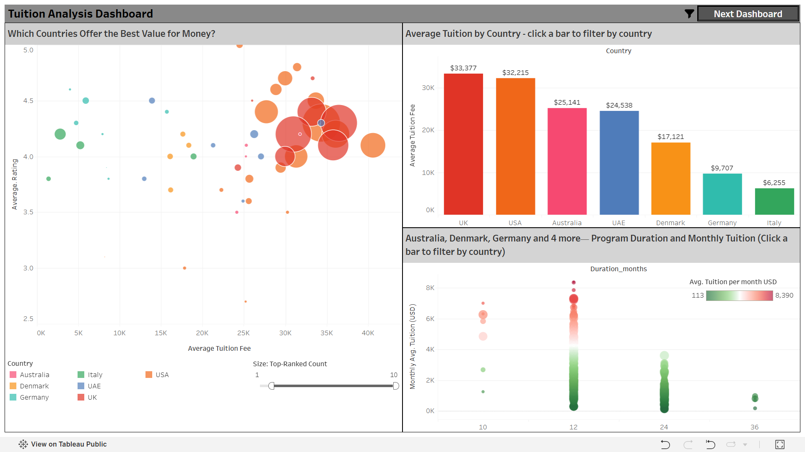
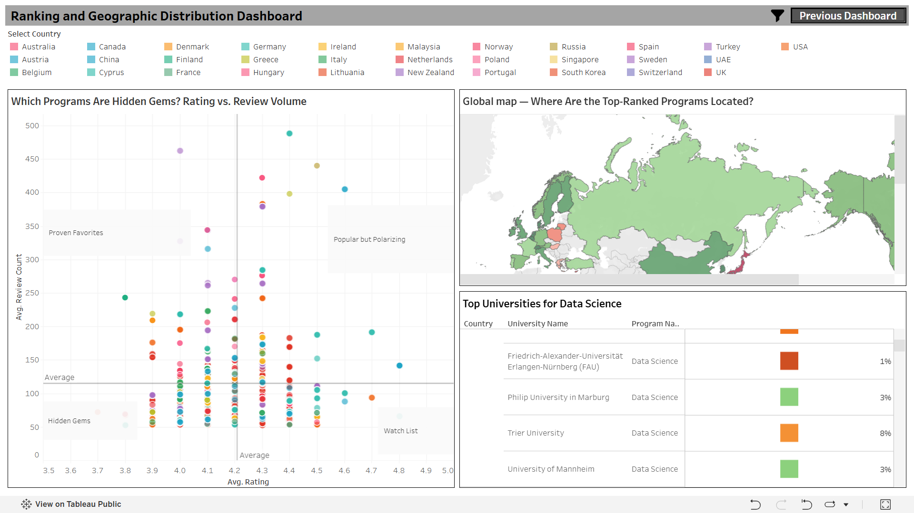

# Global Analysis of IT Master's Programs

## Quick Links

- **Live Dashboard:** [View on Tableau Public](https://public.tableau.com/views/GlobalITMastersProgramsAnanlysis/Dashboard1?:language=en-US&:sid=&:redirect=auth&:display_count=n&:origin=viz_share_link)
- **Dataset (CSV):** [View Dataset](data/CS_master_program_details_top35_countries.csv)
- **Scraper Code:** [View Scraper](src/scraper.py)
- **Data Source:** [Mastersportal website](https://www.mastersportal.com/)
- **Full Repository:** [GitHub Repo](https://github.com/SheikhAnandee/Global-IT-Masters-Program-Analysis.git)
- **Contact:** anandeehasan24@gmail.com

## Objective

Build a centralized, analysis-ready dataset and interactive Tableau dashboard to compare **Computer Science & IT Master's programs across 35+ countries**.

## Key Questions

This project explores:

- Does higher tuition correspond to better student ratings?
- Which countries offer more affordable Master's programs?
- How does program duration affect monthly tuition?
- Can highly rated but less-reviewed programs be identified as **"Hidden Gems"**?
- Where are top-ranked CS & IT programs geographically concentrated?
- Which destinations offer a stronger balance between **cost, rating, duration, and reputation**?
  
## Project Background

Comparing Computer Science and IT Master's programs across countries can be challenging because program information is fragmented across different websites and presented in inconsistent formats.

This project addresses that problem by automating the collection of standardized program-level data from [MastersPortal](https://www.mastersportal.com/).

Using **Selenium** and **Undetected-Chromedriver**, the project collects CS & IT Master's program information and transforms it into a structured dataset for cross-country analysis.

The resulting dataset enables comparisons of tuition, ratings, duration, reviews, rankings, and geographic distribution.

## Data Scraping & Preprocessing

### Data Collection
Program data is collected from paginated search results on [MastersPortal](https://www.mastersportal.com/) using Selenium and Undetected-Chromedriver.

Key attributes collected include:

- Program Name
- University
- City
- Country
- Tuition Fee
- Duration
- Average Rating
- Review Count
- Global Ranking Percentage
- Program Links

### Data Cleaning
The collected data is processed using Pandas.

Key preprocessing steps include:

- Parsed location strings into separate city and country fields
- Cleaned review counts
- Converted tuition values into numeric format
- Handled missing values
- Standardized program information
- Prepared the final analysis-ready dataset

The final dataset is available here:

[View Dataset](data/CS_master_program_details_top35_countries.csv)


## Data Analysis & Visualization
### Dashboard 1: Tuition & Program Cost Analysis

<p align="center">
  
</p>

### Visualizations

1. **Scatter Plot: Average Tuition Fee vs. Average Rating**
   - Examines the relationship between tuition fees and student ratings.
   - Points are color-coded by country.
   - Bubble size represents the number of top-ranked programs.
   - Helps identify countries with highly rated programs without the highest tuition costs.

2. **Bar Chart: Average Tuition Fee by Country**
   - Compares average tuition fees across countries.
   - Highlights the highest- and lowest-cost destinations.
   - Selecting a country filters the other dashboard visualizations.

3. **Scatter Plot: Monthly Average Tuition vs. Program Duration**
   - Examines cost efficiency across different program lengths.
   - Shows whether longer programs necessarily have higher monthly tuition.
   - Dynamically updates based on the selected country.
   - Monthly tuition is represented through color intensity.

### Dashboard 2: Rankings & Geographic Distribution

<p align="center">
  
</p>

### Visualizations

1. **Scatter Plot: Rating vs. Review Volume — "Hidden Gems" Quadrant Analysis**
   - Compares average student rating with review volume.
   - Divides programs into four groups:
     - **Proven Favorites:** High rating + high review volume
     - **Popular but Polarizing:** Lower rating + high review volume
     - **Hidden Gems:** High rating + low review volume
     - **Watch List:** Lower rating + low review volume
   - Helps identify highly rated programs that have not yet built a large review base.

2. **Global Map: Geographic Distribution of Top-Ranked Programs**
   - Shows the geographic concentration of top-ranked CS & IT programs.
   - Uses country-level shading to highlight major education hubs.
   - Helps reveal geographic patterns in the distribution of highly ranked programs.

3. **Table: Top Universities for Data Science**
   - Displays university name, country, and program.
   - Includes a percentage indicator for ranking performance.
   - Provides a focused comparison of Data Science programs within the dataset.

4. **Country Filter**
   - Allows users to select individual countries or multiple countries.
   - Filters the relevant dashboard visualizations dynamically.
     
## Interesting Findings

- **The UK has the highest average tuition fee ($33,377), while Italy has the lowest ($6,255)**, creating a substantial gap in the cost of pursuing a CS & IT Master's program.

- **Programs with similar ratings (≈4.0–4.5) span a wide tuition range**, suggesting that higher tuition does not necessarily guarantee higher student satisfaction.

- **Most programs in the USA have a 12-month duration**, making the one-year Master's format particularly common among US-based programs in the dataset.

- **Some 24-month programs have lower monthly tuition than certain 10–12 month programs**, showing that longer programs are not necessarily more expensive when cost is normalized by duration.

- **The "Hidden Gems" quadrant identifies highly rated programs with relatively low review volume**, highlighting programs that receive strong student feedback but have a smaller review base.

- **Top-ranked CS & IT programs are geographically concentrated**, with a noticeable cluster across European countries alongside several standout hubs in other regions.

- **Highly rated programs appear across both lower- and higher-tuition categories**, suggesting that tuition alone is not a reliable indicator of perceived program quality.

- **Several lower-tuition destinations contain highly rated programs**, indicating that students may find strong value-for-money opportunities outside traditionally expensive study destinations.

## Technology Stack

| Category | Tools |
|---|---|
| Data Collection | Python, Selenium, Undetected-Chromedriver |
| Data Processing | Pandas, NumPy |
| Data Visualization | Tableau |
| Data Storage | CSV |
| Development | VS Code, Jupyter Notebook |
| Version Control | Git & GitHub |

## Project Structure

```text
Global-IT-Masters-Program-Analysis/
│
├── data/
│   └── CS_master_program_details_top35_countries.csv
│
├── src/
│   └── scraper.py
│
├── visualizations/
│   ├── dashboard1.png
│   └── dashboard2.png
│
├── README.md
├── requirements.txt
└── LICENSE

##  Build from Sources and Run the Selenium Scraper

### Clone the repository

```bash
git clone https://github.com/SheikhAnandee/Global-IT-Masters-Program-Analysis.git
cd Global-IT-Masters-Program-Analysis

2) Initialize and activate virtual environment <br/> 
For Windows:
 ```bash
    python -m venv venv
    venv\Scripts\activate
 ```
For Linux / macOS:
 ```bash

   python3 -m venv venv
   source venv/bin/activate

 ```
3) Install dependencies
 ```bash

    pip install -r requirements.txt

 ```
4) Download the correct version of Chrome WebDriver that matches your browser version:https://developer.chrome.com/docs/chromedriver/downloads

5) Run the scrapper
 ```bash

  python python src/scraper.py--chromedriver_path <path_to_chromedriver>

 ```
 
6) After running the scraper, the collected program information will be exported as a CSV file.

The processed dataset used for the Tableau dashboards is also available here:

https://github.com/SheikhAnandee/Global-IT-Masters-Program-Analysis/blob/main/data/CS_master_program_details_top35_countries.csv
   
##  Analytics & Interactive Dashboard

Explore the complete interactive Tableau dashboard to analyze:

- Tuition trends
- Student ratings
- Program duration
- Review volume
- Rankings
- Geographic distribution
- Cross-country comparisons

 **Live Dashboard:**  
 [View on Tableau Public](https://public.tableau.com/views/GlobalITMastersProgramsAnanlysis/Dashboard1?:language=en-US&:sid=&:redirect=auth&:display_count=n&:origin=viz_share_link)

## Limitations
- The analysis is based on program information available from MastersPortal at the time of data collection.
- Tuition fees and program details may change over time.
- Student ratings and review counts depend on the availability and coverage of reviews on the source platform.
- The dataset represents a comparative snapshot and should not be considered a definitive ranking of all CS & IT Master's programs worldwide.
- The "Hidden Gems" classification identifies programs with high ratings and relatively low review volume; it does not independently verify academic quality.

## License

This project is licensed under the **MIT License**.  
You are free to use, modify, and distribute this project with proper attribution.

## Acknowledgments

- **MastersPortal** — Source of program information
- **Tableau Public** — Interactive data visualization
- **Selenium & Undetected-Chromedriver Community** — Web automation
- — **Pandas & NumPy** — Data processing and analysis
- **Open Source Community** — Python libraries and ecosystem
  
## Feedback & Contact
Suggestions, questions, and feedback are welcome.
<br/>
Email: anandeehasan24@gmail.com
